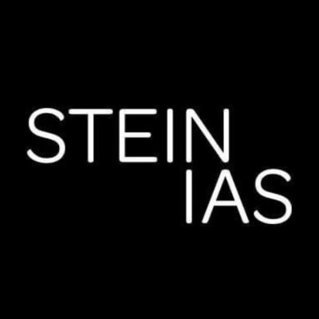

## Randstad USA (Bank of America)
- *Application Architect* | Aug '22 - Aug '23
- 
- Tags: Work
- Badges:
  - Contract [blue]
- List Items:
  - Spearheaded the development of a data quality dashboard, enabling management and submission of trading exclusions for regulatory compliance within Bank of America’s infrastructure
  - Developed front-end modules, including a drag-and-drop interface with multi-selection functionality and a datepicker with date range selection, improving user interaction and workflow efficiency
  - Leveraged ag-Grid’s API to develop interactive data tables to support user actions, including row selection, form submissions, filtering, sorting, and grouping functionalities
  - Coordinated the integration of UI components with APIs in collaboration with back-end developers, ensuring optimized data flow and reducing load time

## SteinIAS
- *Frontend Developer* | Feb '20 - Sept '20
- 
- Tags: Work
- Badges:
- List Items:
  - Collected and analyzed requirements from clients as a liaison for single page applications with meticulous attention to details in documenting the acceptance criteria
  - Collaborated actively with UX designers to translate and create wireframe ideas into production grade code using React, JavaScript, Bootstrap, HTML5, and CSS/SCSS
  - Programmed and remodeled reusable React UI components for the Storybook library to improve the look, feel, and consistency of Stein IAS front-facing web applications

## App Academy
- *Technical Instructor* | Jul '19 - Jan '20
- 
- Tags: Work
- Badges:
- List Items:
  - Managed personal study sessions with 60 students from incoming cohorts on course material such as Ruby fundamentals, Python, testing, object oriented programming, and recursion for an over 90% graduation rate
  - Mentored students in full-stack multi-tier web architecture and improved a deeper understanding of React, Redux, Ruby on Rails, and SQL
  - Facilitated mock interviews to cultivate and enhance interview skills of many talented junior developers with many of them getting into top fortune 500 companies