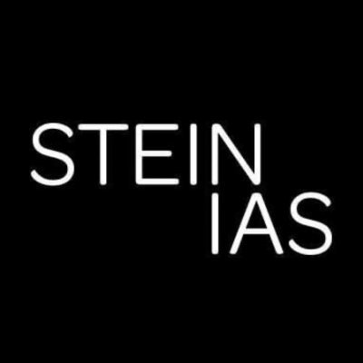

## Randstad USA (Bank of America)
- *Application Architect* | Aug'22 - Aug'23
- 
- Tags: Work
- Badges:
  - Contract [blue]
- List Items:
  - Spearheaded the development of a data quality dashboard, enabling management and submission of trading exclusions for regulatory compliance within Bank of America’s infrastructure
  - Orchestrated seamless integration of UI components with APIs in collaboration with back-end developers, ensuring optimized data flow and functionality for enhanced user experience
  - Designed intuitive user interfaces and frontend modules using TypeScript, React, and Redux, enhancing workflow efficiency within the Data Quality App
  - Gathered and refined specifications and requirements for UX design, ensuring understanding and alignment with project goals

## SteinIAS
- *Frontend Developer* | Feb'20 - Sept'20
- 
- Tags: Work
- Badges:
- List Items:
  - Collected and analyzed requirements from clients as a liaison for the single page application, with meticulous attention to details in documenting the acceptance criteria
  - Collaborated actively with UX designers to translate and create wireframe ideas into production grade code using React.js, JavaScript, Bootstrap, HTML5, and CSS/SCSS
  - Programmed and remodeled reusable React UI components for the Storybook library to improve the look, feel, and consistency of Stein IAS front-facing web applications